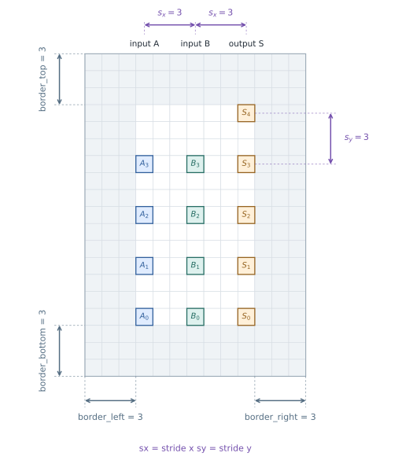
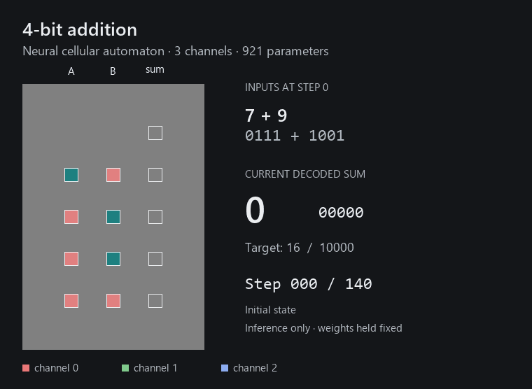

# ncpu-simplified

`ncpu-simplified` studies whether a very small neural cellular automaton can
perform exact binary addition using sparse, single-cell inputs and outputs.
Every cell applies the same local update rule. The operands are initial
conditions; computation and memory must emerge in the evolving grid state.





An actual inference of **7 + 9 = 16** across 140 updates. RGB shows the three
evolving channels; white outlines mark the original input and output locations.

The primary inspiration for this project is Iliya Zhechev's
[`ichko/ncpu`](https://github.com/ichko/ncpu). This repository is a fresh,
reduced implementation with independent Git history, built to explore and
extend that central idea. It is also informed by the
[*Emergent Models: Intelligence from Tiny Substrates*](https://arxiv.org/abs/2608.14019)
theoretical framework and by Béna and Faldor's
[*A Path to Universal Neural Cellular Automata*](https://arxiv.org/abs/2505.13058).
The long-term goal is a trainable program channel that selects different
computations while retaining one shared NCA update rule.

## How it works

Two numbers are placed on a grid, one bit per cell. A third column marks
where their sum will be read, with an extra row for the carry bit. The diagram
above shows the default 4-bit geometry.

The horizontal and vertical strides, `sx` and `sy`, are independent parameters
in `GeometryConfig`, easily changed in the notebook's first cell. They measure
centre-to-centre spacing, so a stride of 3 leaves 2 empty cells between bit
positions. The four borders are independently configurable too: each counts
complete empty rows or columns, with the top border measured above the carry
row.

`A` and `B` are the operands; `S` is the sum, with the least significant bit
at the bottom. Input bits use `-1` for zero and `+1` for one, surrounded by
neutral cells valued `0`. Output positions begin empty: the diagram labels
where we read the answer, not extra symbols given to the model.

Each cell holds a small vector of continuous state values. At every step, a
shared neural network observes its local 3x3 neighbourhood and proposes an
additive state update. In the default setup, inputs are written into channel 0
only at the beginning. All three channels can then evolve, including channel
0, while channels 1 and 2 provide additional space for computation and memory.
There are no hand-written carry rules or connections between distant bits.

Training unrolls these local updates through time. The model first evolves
freely, then receives supervision over a window of steps rather than only at
one final instant. The loss is mean squared error over output cells, examples,
and supervised steps. This asks the model to produce an answer and retain it
throughout that window; it does not guarantee stability indefinitely.

## What this explores

The central question is how much computation can emerge from a tiny shared
rule, and which design choices help it learn reliable, reusable behaviour.
The notebook lets you train on one operand width and test on larger widths
without changing the learned rule. Good training accuracy alone is not
evidence of general addition: extrapolation and stability need to be checked
separately. Past experiments and their comparability limits are recorded in
[EXPERIMENTS.md](EXPERIMENTS.md).

The default experiment uses 4-bit operands, three state channels, a 57-unit
hidden layer, and no write gate: just **921 trainable parameters**, shared by
every cell. Perception combines fixed identity and Sobel filters with one
learnable 3x3 kernel initialized as a normalized Laplacian. Evolution uses
zero padding and 70 free steps followed by 70 supervised steps (71–140).

You can vary the spacing and borders, channel count, hidden width, gates,
rollout length, and supervision window. Inputs may evolve or remain frozen.
Perception can include a fixed Laplacian and any number of learnable kernels,
initialized from a Laplacian or reproducible random values.

Updates are synchronous by default (`fire_rate=1.0`). Setting a rate strictly
between `0` and `1` enables stochastic asynchronous updates: each cell has an
independent chance to fire on each step, with one decision shared by all its
channels. Selected cells still read the same pre-update grid state.

## Getting started

Clone the repository and run these commands from its root:

```sh
conda env create -f environment.yml
conda activate slackenv
python -m pip install -e ".[dev]"
python -m pytest -q
```

If `slackenv` already exists, replace the first command with
`conda env update -n slackenv -f environment.yml`. The supplied environment
targets Python 3.10, PyTorch 2.5.1, and CUDA 12.1. The editable installation
lets the notebook, tests, and visualizer use the same local source code.

## Working in the notebook

Open [run/run.ipynb](run/run.ipynb) with the `slackenv` kernel, for example in
VS Code. Its four code cells take you through the experiment:

1. Choose settings, run `validate()`, and inspect the grid, parameter count,
   and memory estimate.
2. Train the model or resume a checkpoint.
3. Evaluate every input pair at 4, 6, and 8 bits.
4. Watch an inference as an embedded RGB animation.

Set `SEEDS` in the first cell to repeat the same experiment across independent
seeds. Each run writes to `checkpoints/seed_N/`; the checkpoint with the lowest
exhaustive validation loss is also saved as `checkpoints/best.pt`. Checkpoints
are local artifacts and are not included in Git.

Optional W&B reporting can be enabled by installing
`python -m pip install -e ".[tracking]"` and setting `WANDB_PROJECT` in the
notebook. It is disabled by default.

## Watching the computation

The browser visualizer lets you choose operands, change the bit width and
rollout length, and play or scrub through the evolving grid. Channels 0, 1,
and 2 appear as red, green, and blue, using `tanh` normalization for display
only. This offers a view of the evolving state, not just the final answer.

After training creates `checkpoints/best.pt`, run
[visual_inference.bat](visual_inference.bat) to open the visualizer at
`http://127.0.0.1:8000`. **This `.bat` launcher is Windows-only.**

## Source layout

```text
src/ncpu_simplified/
  config.py       experiment configuration and invariants
  layout.py       sparse ternary geometry, encoding, and decoding
  model.py        perception, update rule, gates, and NCA evolution
  training.py     supervised timing, optimization, and checkpoints
  evaluation.py   exact accuracy, MSE, stability, and extrapolation
  validation.py   fast structural and numerical validation
  visualize.py    GIF utilities and the local Flask server
```

## Attribution and licensing

The architecture and experiments developed from the questions explored in
`ichko/ncpu`, and that lineage should remain visible in derived work. The
upstream repository does not currently include a license file. This repository
therefore uses a clean implementation rather than copying its source.

Compared with the [original NCPU adder](https://github.com/ichko/ncpu/blob/22c69de7b7df7f576e27e6879a06345374da92b4/scripts/train_adder.py), this implementation defaults to a
smaller 3-channel, 57-hidden-unit rule; a mutable input in channel 0 rather
than a frozen duplicate in channel 1; and synchronous updates (`fire_rate=1`)
rather than stochastic updates at `fire_rate=0.5`. It also replaces large bit
patches and 7x7 perception with parametrically spaced single cells and 3x3
perception with configurable fixed and learnable filters, and separates free
evolution from the supervised time window. The
local, shared, additive NCA update and zero-padded boundary remain conceptually
the same.

This project has been AI-assisted by OpenAI Codex. Although tested, bugs or
unexpected behaviours may still be present.
